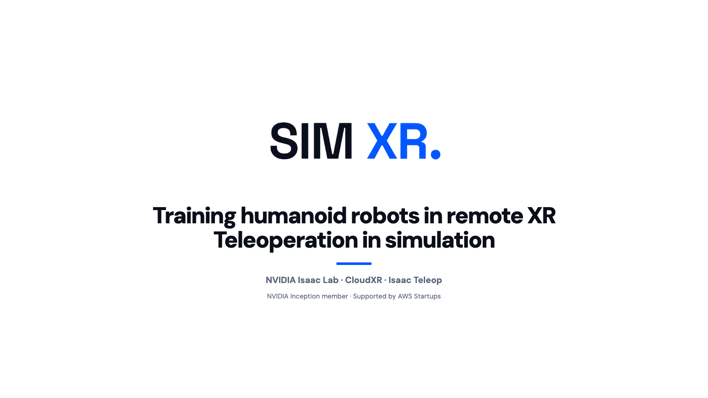
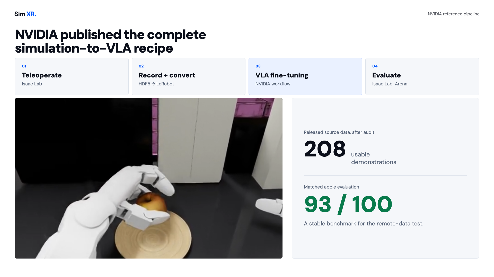
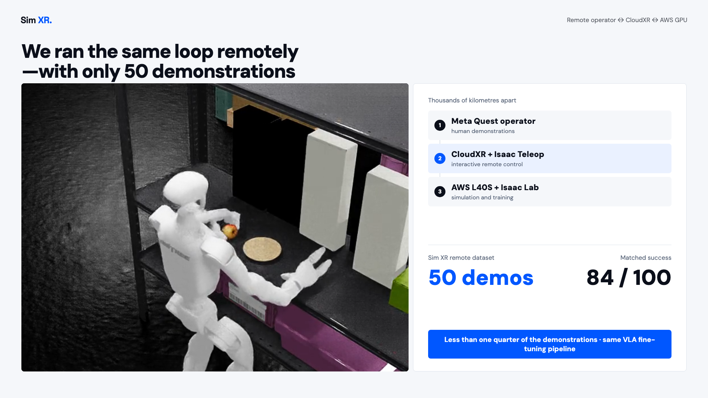
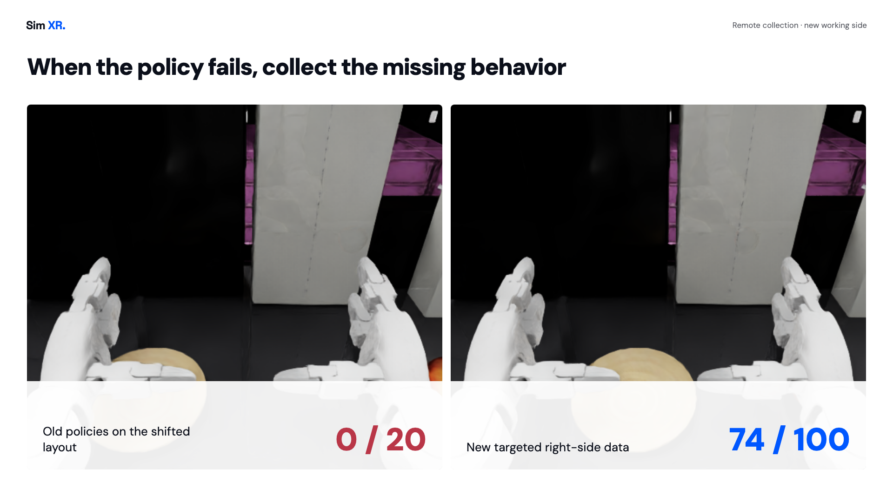
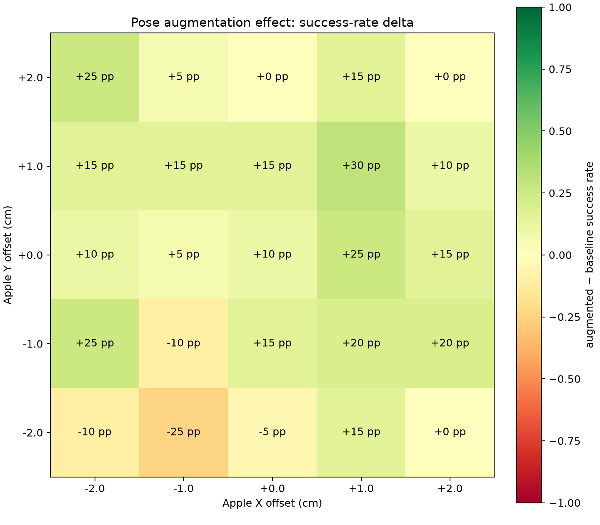
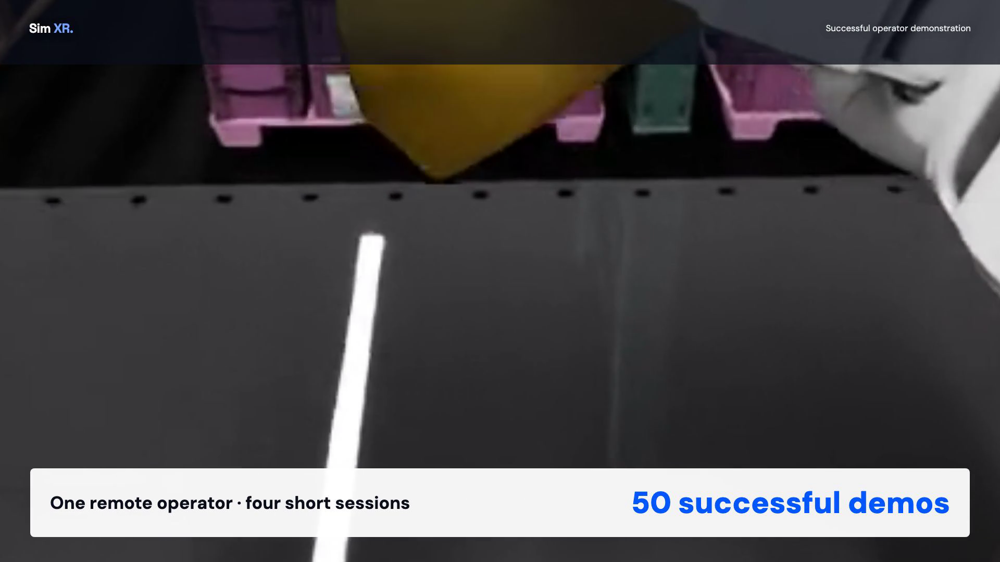
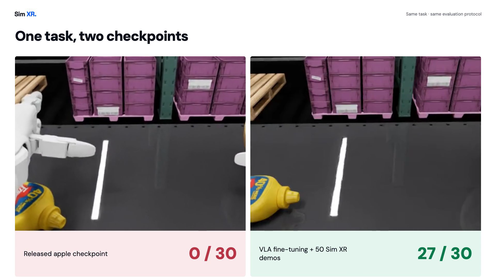
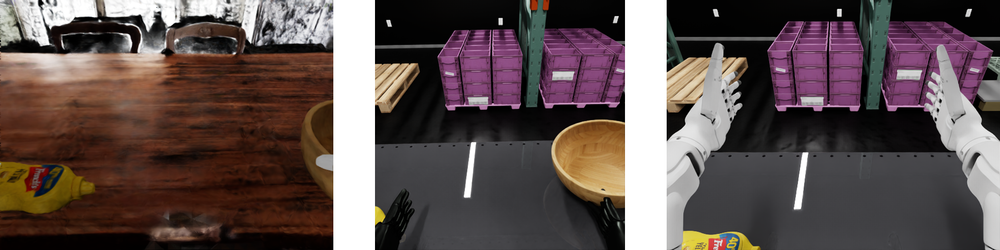

# From NVIDIA’s 208 Demonstrations to a New Skill with 50 Remote VR Episodes

NVIDIA published something unusually useful for the robotics community: a complete path from human demonstrations in Isaac Lab to VLA fine-tuning and closed-loop evaluation in Isaac Lab-Arena. We used that release to test a practical question. When a policy fails on a new layout or object, can a remote operator collect enough targeted demonstrations to improve it without consuming physical robot hours?

We first audited NVIDIA’s released files and identified 208 usable, non-empty trajectories. A checkpoint trained from that data reached 93/100 in our matched apple evaluation. We then ran the same training and evaluation loop with 50 selected demonstrations collected through Meta Quest, Isaac Teleop, and CloudXR. The operator and the AWS GPU server were thousands of kilometres apart. That 50-demo checkpoint reached 84/100.

The nine-point gap is real. So is the leverage. Less than one quarter as many demonstrations, collected remotely, produced a working policy through the same training interface. When we changed the task geometry, both old apple policies scored zero. Targeted right-side demonstrations raised success to 74/100. When we replaced the apple with a mustard bottle and changed the destination, the apple checkpoint scored 0/30. Fifty remote demonstrations produced a new checkpoint that scored 27/30.

The central result is not that one policy generalized to everything. It did not. The result is a repeatable loop: identify a bounded failure, connect a remote operator, collect the missing behavior, validate the data, fine-tune from a controlled base, and measure the change under matched conditions.

> Targeted demonstrations for measurable policy improvement, collected remotely and evaluated under matched conditions.

## NVIDIA published the complete simulation-to-VLA recipe

NVIDIA’s [end-to-end GR00T tutorial](https://developer.nvidia.com/blog/develop-humanoid-robot-policies-end-to-end-with-nvidia-isaac-gr00t/) uses a Unitree G1 humanoid standing at a shelf. An apple begins near one hand, and the policy must pick it up and place it on a plate. NVIDIA released the task, a fine-tuned checkpoint, and a dataset on [Hugging Face](https://huggingface.co/datasets/nvidia/Arena-G1-Static-PickNPlace-Task). The documented recipe covers the full sequence:

`teleoperate in Isaac Lab → record HDF5 → convert to LeRobot → fine-tune GR00T N1.7 → evaluate in Arena`

We treated the public files as data to audit, not just download. The headline counts across the blog, dataset card, and metadata do not agree. Our file-level inspection found 251 HDF5 groups marked as successful, but 43 were empty placeholders. We rebuilt a contiguous LeRobot dataset from the 208 non-empty trajectories: 35,066 frames, 208 parquet episodes, and 208 video streams.

We then fine-tuned GR00T N1.7 for 20,000 steps on an NVIDIA L40S and evaluated the resulting checkpoint through Isaac Lab-Arena’s official split policy-server and simulator path. The first four-episode validation succeeded, but we do not use that small run as a representative success-rate claim. In a later matched 100-episode evaluation, the checkpoint trained from NVIDIA’s released data scored 93/100.

That gave us a stable reference implementation: released demonstrations in, validated LeRobot data out, a new checkpoint, and closed-loop metrics plus video evidence.

## Fifty demonstrations, collected thousands of kilometres from the server

Next, we collected the same apple-to-plate interaction through the Sim XR teleoperation stack using Meta Quest 3 hand tracking. Isaac Teleop carried the operator input, CloudXR streamed the interactive simulation, and the task ran on our AWS GPU infrastructure. The human operator was thousands of kilometres from the server. We recorded the resulting actions, robot state, camera observations, object motion, and success state without placing the operator inside a robotics laboratory.

We selected the best 50 demonstrations, converted them through the same training interface, and fine-tuned a fresh GR00T N1.7 checkpoint from the same base model. On the original apple layout, using the same 100-episode evaluation seed:

| Policy | Training source | Success | Object moved |
|---|---|---:|---:|
| NVIDIA-data checkpoint | 208 usable released trajectories | 93/100 | 94/100 |
| Sim XR checkpoint | 50 selected Quest demonstrations | 84/100 | 98/100 |

The nine-point gap matters, and we are not hiding it. The Sim XR policy did not match the released-data checkpoint. But 84 successes in 100 closed-loop episodes, using 50 rather than 208 demonstrations, validated the infrastructure from remote operator input to learned behavior.

This is the product value behind the benchmark. The operator does not need to be co-located with the robot lab or GPU server. When a team finds a recurring policy failure, it can connect the right operator, collect a focused batch in simulation, and run the same data-to-policy loop without moving people or consuming additional robot hours.

It also exposed a data-quality issue. The initial recording format preserved simulation steps but not full wall-clock timing. The trajectories were converted at a nominal 50 Hz, so we could not make a clean statement about the operator’s real-time cadence. That audit now informs the next collection protocol: timing must be measured, not assumed, especially when the remaining errors cluster around grasp closure and stable hold.

## When the old policies scored zero, we collected the missing behavior

We then moved the apple and plate across the workspace so the robot had to use the other working side. This was not a cosmetic change. It altered approach direction, occlusion, reach, grasp orientation, and transport path.

The old checkpoints failed on the new `swapped-separated` layout:

- NVIDIA’s released apple checkpoint: 0/20.
- Our original-layout Quest checkpoint: 0/20.

We collected 60 successful right-side demonstrations through the same remote teleoperation stack and trained new checkpoints. The best-50 dataset produced 72/100 success; training on all 60 produced 74/100. Both moved the apple in 100/100 attempts.

That is meaningful learning, but it is not a solved task. We had set a strict continuation gate of more than 75%, and 74% did not pass. Most failures were not high-level planning errors: the hand reached and moved the object, but contact did not become a stable lift, or the apple was lifted and then dropped.

This distinction matters. “The model failed” is not an actionable diagnosis. “The model reaches the object but lacks consistent grasp-and-hold supervision” is.

## Turning failures into targeted training data

We saw the same pattern at a smaller scale when we shifted the apple by only a few centimetres. In a 5 × 5 grid of starting positions, with 20 closed-loop episodes per cell, the original checkpoint scored 400/500, or 80.0%.

Every failure was classified from trajectory evidence:

- 69 contacts without lift;
- 17 lifts followed by a drop;
- 10 transports without release;
- four transports that missed the destination.

We selected the eight weakest cells and collected 240 additional policy attempts there. We retained 181 trajectories that the environment verified as physically successful, combined them with the 208 usable original episodes, and trained a separate 20,000-step checkpoint on the resulting 389-episode dataset.

The matched evaluation improved from 400/500 to 448/500:

| Evaluation slice | Original checkpoint | Pose-augmented checkpoint | Change |
|---|---:|---:|---:|
| All 25 cells | 400/500 (80.0%) | 448/500 (89.6%) | +9.6 pp |
| Eight selected weak cells | 110/160 (68.8%) | 131/160 (81.9%) | +13.1 pp |
| Other 17 cells | 290/340 (85.3%) | 317/340 (93.2%) | +7.9 pp |

This was success-filtered behavioral cloning, or self-imitation, not classical reinforcement learning. The environment helped us decide which data to keep, but the model update remained supervised.

The result was also not uniformly positive. Eighteen grid cells improved, three were unchanged, and four regressed. That is precisely why we use a spatial benchmark instead of one headline number: a single aggregate can hide where robustness was gained and where it was traded away.

## The same remote loop created a new mustard skill

The apple experiments showed that we could reproduce and modify a published task. The stronger test was whether the same remote collection loop could create a task absent from the original dataset and teach it using demonstrations collected through our own infrastructure.

On our Oregon server, we composed a cross-body task: a mustard bottle starts on the left, a wooden bowl sits on the right, and the instruction is “move the mustard bottle to the bowl.” The geometry matters. The bottle sits near the left arm’s working limit, while the destination is on the opposite side. The policy must carry the object across the body instead of replaying the short left-side motion learned from the apple task.

The object choice came from operator experience rather than visual novelty. A lemon was too small for a stable transfer between the G1’s three-finger hands. A white box had poor contrast against the shelf. The mustard bottle was elongated enough to grasp from either end, and its yellow body remained easy to see through the robot-head camera.

Under the same scene, seed, CPU-physics setting, and contact-sensor success definition:

- the released apple checkpoint scored 0/30;
- GR00T N1.7 fine-tuned on 50 successful Sim XR operator demonstrations scored 27/30, or 90%.

The 50 demonstrations came from one remote VR operator in four short sessions. Every retained episode passed the environment’s success condition before conversion to the LeRobot training dataset.

The full fine-tune ran for 20,000 steps and took approximately 5.5 hours on one L40S. Because the evaluation contains 30 episodes, the raw count, 27/30, is more informative than the percentage alone. Its Wilson 95% interval is approximately 74.4–96.5%.

This does not demonstrate zero-shot object generalization. We post-trained the model for the new task. What it demonstrates is more useful for our current stage: we can compose a new simulation task, collect clean human demonstrations remotely, convert and validate the data, fine-tune the VLA, and produce a large improvement under a matched closed-loop protocol.

The mustard task also became a practical test fixture for the infrastructure around the policy. The team rendered the task in a scanned-room environment, ported the scene and teleoperation flow to a Fourier GR1T2, and accepted a Unitree G1 configuration with five-finger Inspire FTP hands in live VR. These are follow-up simulation and teleoperation checks, not evidence that one mustard checkpoint works on every embodiment. They show that the task, camera, recording, and operator workflow can be adapted without rebuilding the entire data pipeline.

## What these experiments prove, and what they do not

Together, the experiments validate a working Sim XR loop:

1. compose or reproduce a manipulation task in simulation;
2. stream it to a remote VR operator;
3. record demonstrations with camera, state, action, and success evidence;
4. audit and convert the dataset into the policy’s training format;
5. fine-tune GR00T N1.7;
6. evaluate hundreds of closed-loop episodes;
7. classify failures and collect targeted follow-up data.

They do not prove production reliability, real-robot deployment, or a reduced sim-to-real gap. Every result reported here is from simulation. We also do not claim that photorealism alone fixes policy transfer, or that a single trained checkpoint works across arbitrary positions, objects, or embodiments.

The evidence supports a narrower and more defensible conclusion: Sim XR can connect remote operators to cloud simulation, execute the human-data loop for Physical AI, diagnose weak points, and improve a policy through controlled data interventions. The value is not one apple rollout or one mustard checkpoint. It is the ability to collect the next missing behavior without requiring the operator to be in the laboratory or consuming additional robot hours.

## The next gates

Our next experiments are intentionally harder:

- train one policy across both working sides rather than separate left- and right-side checkpoints;
- combine demonstrations with held-out randomization of object and destination positions;
- collect full training datasets for the already accepted alternate-hand and alternate-embodiment configurations;
- add richer visual domains, including 3D Gaussian Splatting, as a controlled observation-layer variable;
- test augmentation derived from validated recordings without changing action or geometry semantics;
- measure whether these interventions improve held-out simulation robustness before making any sim-to-real claim.

3DGS is especially promising for increasing visual diversity, but it is not a substitute for physics, task logic, resets, contact quality, or correct actions. We will treat it as an ablation: compare unchanged geometry and action data across controlled visual domains, then ask whether the policy becomes more robust.

The long-term goal is not to handcraft one impressive rollout. It is to build an infrastructure where human intent can be collected remotely, converted into reliable training data, and iterated against measurable robot behavior at cloud scale.

---

### Sources and evidence

- [NVIDIA technical blog](https://developer.nvidia.com/blog/develop-humanoid-robot-policies-end-to-end-with-nvidia-isaac-gr00t/)
- [Isaac Lab-Arena static apple workflow](https://isaac-sim.github.io/IsaacLab-Arena/main/pages/example_workflows/static_apple/index.html)
- [Isaac Lab-Arena closed-loop evaluation guide](https://isaac-sim.github.io/IsaacLab-Arena/main/pages/example_workflows/static_apple/step_4_evaluation.html)
- [NVIDIA released dataset](https://huggingface.co/datasets/nvidia/Arena-G1-Static-PickNPlace-Task)
- [NVIDIA released checkpoint](https://huggingface.co/nvidia/GN1x-Tuned-Arena-G1-Static-PickNPlace)
- [Public robustness evidence folder](https://drive.google.com/drive/folders/1NO4_MX22qBICK5IYoJdYTPJ7BnGWA7xT)
- [External Oregon experiment artifact](https://claude.ai/code/artifact/a34801aa-dbf1-4eb2-a4b6-c77f4344872e)
